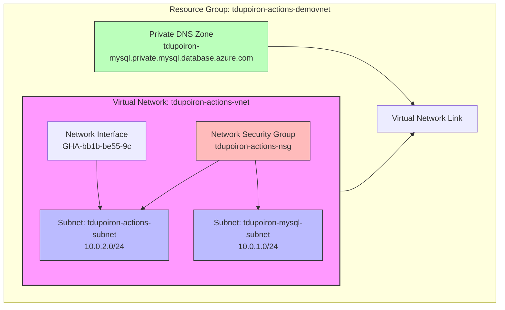

## Network Architecture Diagram

### Architecture Details

1. **Virtual Network Configuration**:
   - Name: `tdupoiron-actions-vnet`
   - Location: France Central
   - Address Space: `10.0.0.0/16`

2. **Subnets**:
   - `tdupoiron-actions-subnet`: `10.0.2.0/24`
   - `tdupoiron-mysql-subnet`: `10.0.1.0/24`
   Both subnets have private endpoints disabled.

3. **Network Security**:
   - Network Security Group: `tdupoiron-actions-nsg`
   - Protects both subnets

4. **Networking Components**:
   - Network Interface: `GHA-bb1b-be55-9c`
   - Connected to the actions subnet

5. **DNS Configuration**:
   - Private DNS Zone: `tdupoiron-mysql.private.mysql.database.azure.com`
   - Connected to the VNet through a Virtual Network Link

This architecture appears to be set up for a GitHub Actions environment with potential MySQL database connectivity, though no active MySQL database connections were found at the time of analysis.
