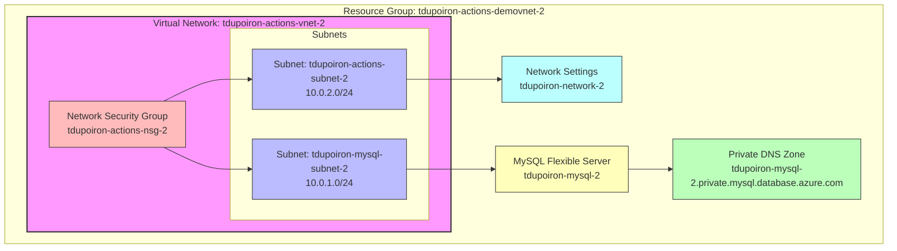

## Network Architecture Diagram

### Architecture Details

1. **Virtual Network Configuration**:
   - Name: `tdupoiron-actions-vnet-2`
   - Location: France Central
   - Address Space: `10.0.0.0/16`

2. **Subnets**:
   - `tdupoiron-actions-subnet-2`: `10.0.2.0/24` (GitHub Actions subnet)
   - `tdupoiron-mysql-subnet-2`: `10.0.1.0/24` (MySQL subnet)
   The MySQL subnet has Microsoft.SQL service endpoints enabled.

3. **Network Security**:
   - Network Security Group: `tdupoiron-actions-nsg-2`
   - Protects both subnets with predefined rules from bicep template

4. **GitHub Integration**:
   - Network Settings: `tdupoiron-network-2`
   - Subnet delegation to GitHub.Network/networkSettings
   - Connected to GitHub Enterprise database ID: 8635

5. **Database Components**:
   - MySQL Flexible Server: `tdupoiron-mysql-2`
   - SKU: Standard_B1ms (Burstable tier)
   - Storage: 32 GB
   - Version: 8.0.21
   - Integrated with virtual network for secure access

6. **DNS Configuration**:
   - Private DNS Zone: `tdupoiron-mysql-2.private.mysql.database.azure.com`
   - Automatically configured for MySQL Flexible Server

This architecture provides a secure environment for running GitHub Actions with a private MySQL database. The Actions runner has access to the database through the virtual network, while both subnets are protected by network security group rules.
